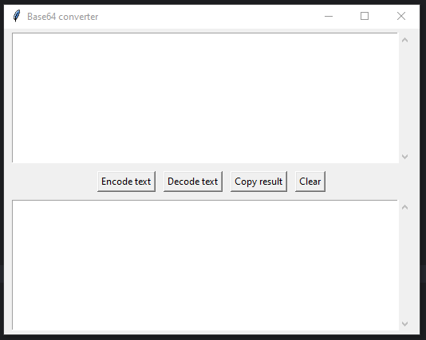

# Base64 Converter (Python + Tkinter)

Application for encoding and decoding text or files in Base64 format.
Simple graphical interface based on Tkinter.

## Features

-  Encoding text to Base64
-  Decoding Base64 to text
-  Copying result to clipboard

## Screenshot

[](assets/screenshot.PNG)

## Start

1. **Clone repository**

   ```bash
   git clone https://github.com/maniek3772/base64_converter.git
   cd base64_converter
   ```

2. **Create a virtual environment (optional)**
   
   ```bash
   python -m venv venv
   ```

   - ***Linux/macOS***
     ```bash
     source venv/bin/activate
     ```
   
   - ***Windows***
     ```bash
     venv\Scripts\activate
     ```   

3. **Install dependencies**

   ```bash
   pip install -r requirements.txt
   ```
   
4. **Run app**

   ```bash
   python main.py
   ```

## Tests

1. **Install pytest**
   ```bash
   pip install pytest
   ```
2. **Run tests**
   ```bash
   pytest tests/
   ```

## Build .exe file (Windows)
1. **Install PyInstaller**
    ```bash
    pip install pyinstaller
    ```
2. **Build .exe file command**

    ```bash
    pyinstaller --onefile --windowed --name Base64_converter --icon=assets/icon.ico main.py
    ```

3. **The EXE file can be found in:**
    ```commandline
    dist/main.exe
    ```